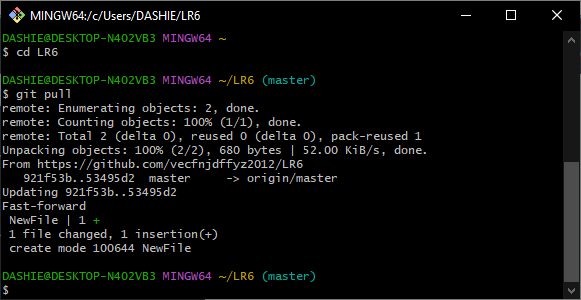
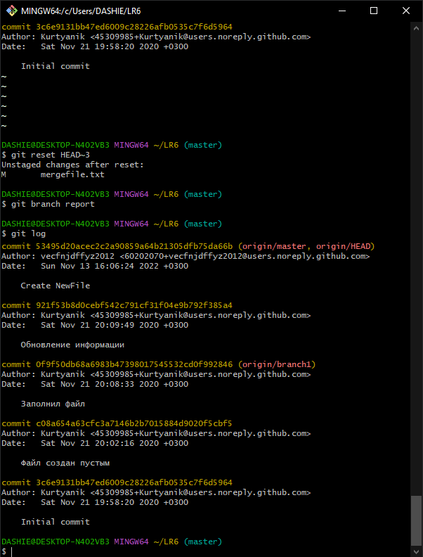

#  LR6 
 Лабораторная работа №6 

## Цель лабораторной работы: 
- *Изучение базовых возможностей системы
управления версиями, опыт работы с Git Api, опыт работы с локальным и
удаленным репозиторием.* 

## Ход работы: 

1. Копирование репозитория в личное хранилище средствами GitHub (Fork)
#### 

#### 

2. Настройка клиента Git
#### 

3. Копирование личного удаленного репозитория на компьютер
#### 

4. Добавление файла через интерфейс GitHub
#### 

#### 

- Подтягивание изменений в локальный репозиторий
#### 

5. Получение истории операций для каждой из веток  

- *Master*
#### 

- *Branch1*
#### 

6. Просмотр последних изменений

- *Master*
#### 

- *Branch1*
#### 

7. Cлияние двух веток в одну (Master)
   - *В процессе возникает конфликт, препятствующий слиянию. При помощи Git status была получена инфомация о возникшей проблеме: для решения конфликта необходимо привязать файл к рабочему пространству.*
#### 

#### 

  
8. Удаление побочной ветки после слияния
#### 

9. Внесение изменений в файл mergefile.txt с комментариями.
#### 

#### 

#### 

10. Откат внесенных изменений (3-х последних коммитов)

- *История изменений до отката*
#### 

 
- *Откат 3-х последних коммитов*
#### 

- *История изменений после отката*
#### 

11. Создание ветки для отчета
#### 

12. Получение отформатированной истории операций
#### 

