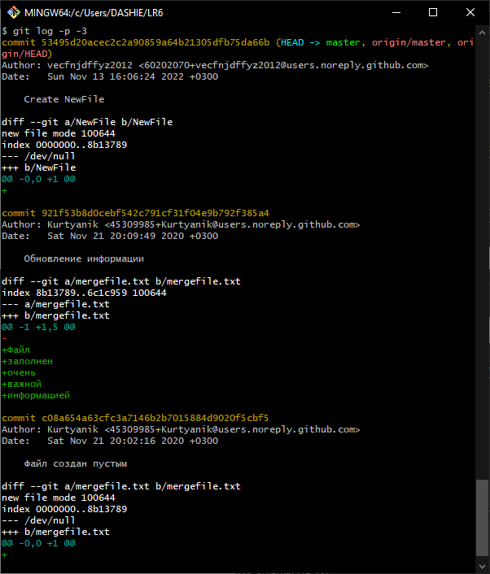
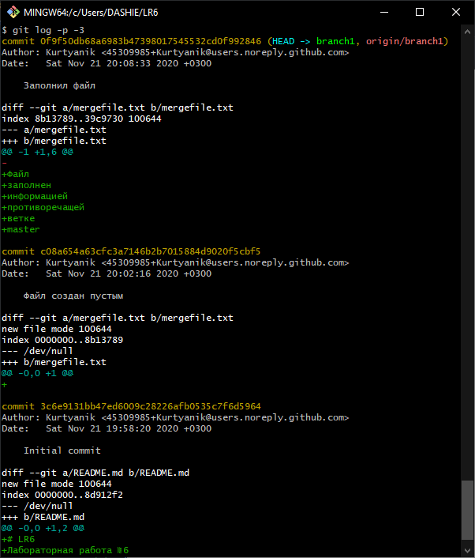
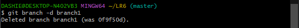
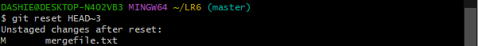

#  LR6 
 Лабораторная работа №6 

## Цель лабораторной работы: 
- *Изучение базовых возможностей системы
управления версиями, опыт работы с Git Api, опыт работы с локальным и
удаленным репозиторием.* 

## Ход работы: 

1. Копирование репозитория в личное хранилище (Fork)

1. Настройка клиента Git

1. Копирование личного удаленного репозитория на компьютер

1. Добавление файла через интерфейс GitHub

	4.1 *Подтягивание изменений в локальный репозиторий*

1. Получение истории операций для каждой из веток  

	5.1 *Master*

	5.2 *Branch1*

1. Просмотр последних изменений

	6.1 *Master*

	6.2 *Branch1*

1. Cлияние двух веток в одну (Master)
   - *В процессе возникает конфликт, препятствующий слиянию. При помощи Git status была получена инфомация о возникшей проблеме:
для решения конфликта необходимо привязать файл к рабочему пространству.*

  
1. Удаление побочной ветки после слияния

1. Внесение изменений в файл mergefile.txt с комментариями.

1. Откат внесенных изменений (3-х последних коммитов)

	10.1 *История изменений до отката*

	10.2 *Откат 3-х последних коммитов*

	10.3 *История изменений после отката*

1. Создание ветки для отчета

